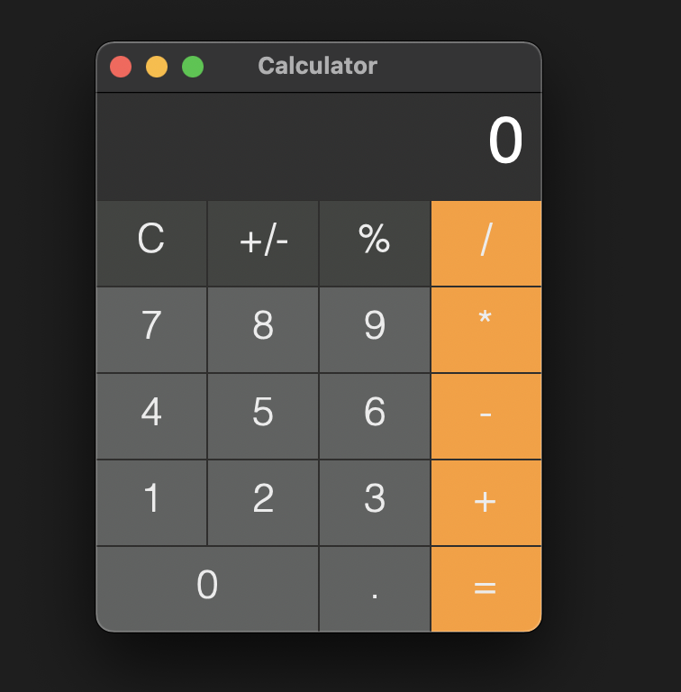

# Calcultor

## 效果展示


## how to build
首先安装gtk([参考链接](https://www.gtk.org/docs/installations/))
```
mkdir build && cd build
cmake ..
make
```
## how to run
```
// 移动到项目根目录
cd ..
build/calculator
```
